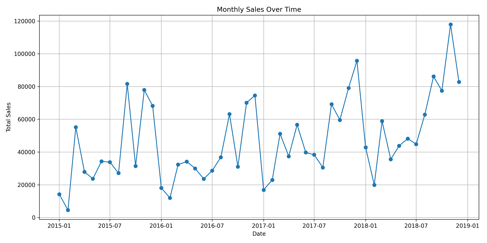
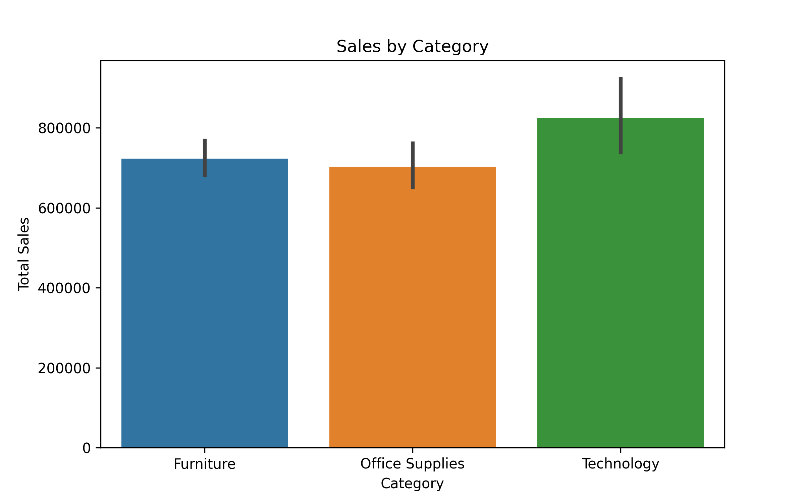
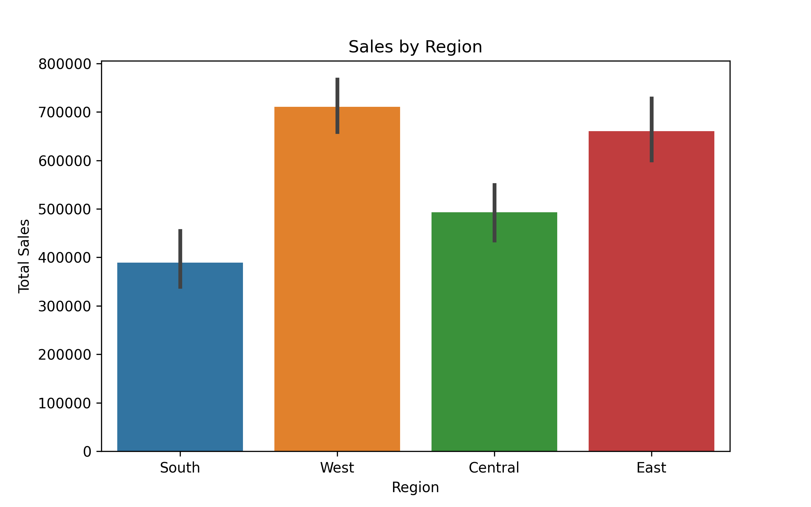

# Superstore Sales Analysis - End-to-End Project

**Data Analytics Project** using Python, Jupyter Notebook, Seaborn, Plotly, Matplotlib, Power BI, and Git.

---

## Project Overview

This project presents a comprehensive analysis of the **Superstore Sales dataset**, offering actionable business insights through:

- Exploratory Data Analysis (EDA) in Python
- Data visualization using both code and dashboard tools
- Interactive dashboard using Power BI

The project simulates a real-world analytics pipeline: from **data cleaning** to **insight generation** to **dashboard storytelling**.

---

## Tools & Technologies

| Category            | Tools & Libraries                              |
|---------------------|----------------------------------------------- |
| Language            | Python                                         |
| Data Analysis       | Pandas, NumPy                                  |
| Visualization       | Seaborn, Matplotlib, Plotly                    |
| Dashboard           | Power BI                                       |
| Notebook            | Jupyter Notebook                               |
| IDE                 | VS Code                                        |
| Environment Mgmt    | virtualenv, pipreqs                            |
| Version Control     | Git, GitHub                                    |

---

##  Data Cleaning & Preparation

- Removed missing values and fixed inconsistent data types
- Checked for similar words using fuzzywuzzy
- Parsed date columns and created derived metrics
- Saved cleaned dataset as `.csv` for reuse in Power BI

---

## Exploratory Data Analysis (EDA)

Performed in Jupyter using Seaborn, Matplotlib, and Plotly:

- 📌 Sales by Category/Sub-Category
- 🧑‍💼 Top Customers by Total Spend
- 🌍 Sales Distribution by State and Region
- 🚚 Shipping Mode impact on performance
- 📅 Time-Series Analysis of Sales Trends

> 🖼️ Visuals include interactive bar charts, line plots, and category-wise plots.

📈 Monthly Sales Trend Analysis (2015–2018)
This line chart illustrates the monthly sales trend over the period from January 2015 to December 2018, based on aggregated transactional data.

**Basic Description**:
The x-axis represents the Year-Month (YYYY-MM format), while the y-axis shows Total Sales in monetary units.

Each point on the line corresponds to the total sales for a given month.

The data shows seasonal fluctuations and growth patterns over the four-year period.

**Key Observations**:

Sales Growth:
There is a gradual upward trend in total monthly sales, especially noticeable in late 2017 and throughout 2018.

Peak Months:

Dec 2018 shows the highest sales peak, crossing 120,000 units. Other visible spikes occurred in mid-2015, early 2016, and late 2017.

Volatility:
The chart reveals significant month-to-month variation, indicating:

Promotions?

Seasonal demand?

Market dynamics or external factors?

**Insights & Recommendations**:
Seasonal Campaigns: Analyze months with consistent spikes and plan campaigns accordingly.

Inventory Planning: Ensure high-demand months (e.g., Q4) are stocked adequately.

Further Analysis: Cross-analyze with customer segments, product categories, or regions to pinpoint growth drivers.

**Sales by Product Category:**
This bar plot shows the total sales distribution across the three main product categories:
This visualization was created using Seaborn's barplot for clear comparison of category-level performance.

| Category        | Total Sales (USD) |
| --------------- | ----------------- |
| Furniture       | \$723,538.48      |
| Office Supplies | \$703,212.82      |
| Technology      | **\$825,856.11**  |

**Key Insights**:
Technology Leads:
Technology outperformed both Furniture and Office Supplies in terms of total sales. This suggests stronger customer demand or higher price points in this category.

Competitive Middle Segment:
Furniture and Office Supplies had nearly identical performance, indicating close competition or similar market behavior in sales volume.

 **Business Implications**:
Technology is a potential focus for marketing, upselling, and bundling strategies.

Furniture and Office Supplies may need targeted promotions or pricing strategies to boost sales.

**Sales by Region**
This bar chart illustrates total sales figures across four major regions: South, West, Central, and East.

Figure: Total Sales by Region (visualized using Seaborn)

**Interpretation**:
🟠 West is the top-performing region, with total sales exceeding $700,000, likely due to a combination of high customer volume and product demand.

🔴 East follows closely behind, also showing strong sales performance, suggesting a healthy market share.

🟢 Central reports moderate sales around the half-million mark, indicating opportunities for growth.

🔵 South records the lowest sales (~$390,000) among the four, pointing to potential gaps in distribution, demand, or marketing outreach.

**Insights & Next Steps**:
Consider investigating product preferences, customer behavior, or demographic factors in underperforming regions.

Explore whether promotional efforts or logistic support vary across regions.

**Top 10 Cities by Sales**

This visualization displays the top 10 U.S. cities ranked by their total sales figures. The horizontal bar chart provides a clear comparison of sales performance across these major metropolitan areas.

Key Observations
New York City leads significantly with sales approaching $250,000, making it the top-performing city by a considerable margin.

West Coast dominance:

Los Angeles ranks second

Seattle and San Francisco both appear in the top 5

San Diego also makes the top 10

Regional distribution:

Northeast: New York City, Philadelphia

West: Los Angeles, Seattle, San Francisco, San Diego

Midwest: Chicago, Detroit

South: Houston, Jacksonville

Sales range:

Highest (NYC): ~$250,000

Lowest (Detroit): ~$50,000

Potential Insights
The coastal cities (both East and West) generally show stronger sales performance than inland cities

There appears to be roughly a 5x difference between the highest and lowest performing cities in the top 10

The presence of tech hubs (Seattle, San Francisco) suggests technology-driven sales may be a significant contributor

---

## Power BI Dashboard

Using the cleaned dataset, I created an interactive Power BI dashboard including:

- ✅ Regional and state-wise sales insights
- ✅ Top-performing categories and products
- ✅ Filters for Order Date and Category
- ✅ KPI Cards for Total Sales, Sales YOY Growth, Total Orders, Distinct Customers and Avg. Order Value (**Using DAX**)

📁 File: `powerbi/superstore_analysis.pbix`

---

